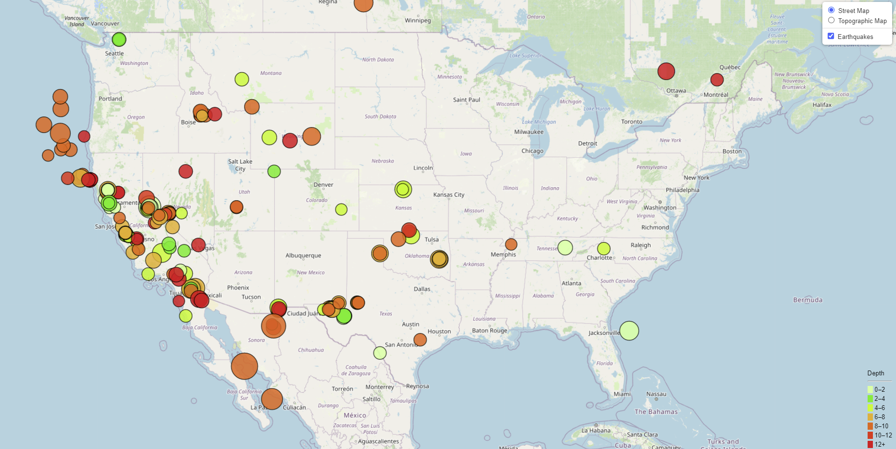

# Leaflet Homework: Visualizing Data with Leaflet

## Background

Welcome to the United States Geological Survey, or USGS for short. The USGS is responsible for providing scientific data about natural hazards, the health of our ecosystems and environment; and the impacts of climate and land-use change. Their scientists develop new methods and tools to supply timely, relevant, and useful information about the Earth and its processes. As a new hire, you will be helping them out with an exciting new project!

The USGS is interested in building a new set of tools that will allow them to visualize their earthquake data. They collect a massive amount of data from all over the world each day, but they lack a meaningful way of displaying it. Their hope is that being able to visualize their data will allow them to better educate the public and other government organizations (and hopefully secure more funding) on issues facing our planet.

## My Task

### Level 1: Basic Visualization

For this homework, my first task was to visualize an earthquake data set.

1. **Getthing the Dataset**

   

The data used for this map was the past 2.5 months of earthquakes data from the USGS website. 

   

2. **Import & Visualize the Data**

   A map was created using Leaflet that plots all of the earthquakes from my data set based on their longitude and latitude.

   * The data markers reflect the magnitude of the earthquake by their size and and depth of the earthquake by color. Earthquakes with higher magnitudes appear larger and earthquakes with greater depth appear darker in color.

   * The popups provide additional information about the earthquake when a marker is clicked.

   * A legend that provides context for the map data.

- - -

___
© 2021  Trilogy Education Services, a 2U, Inc. brand. All Rights Reserved.	
